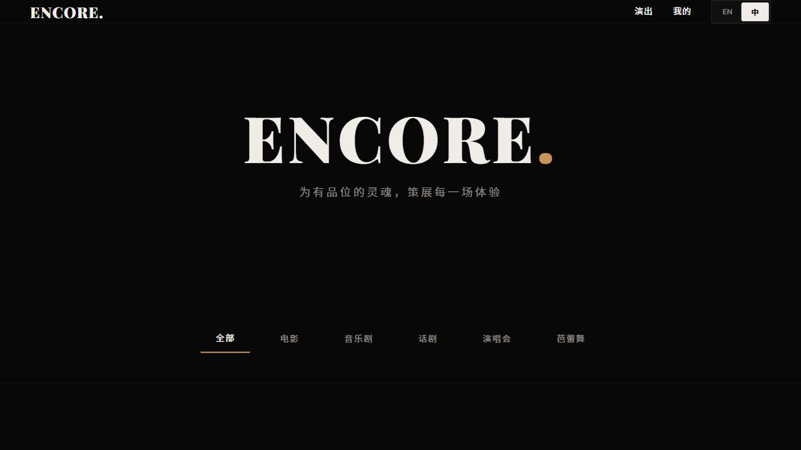
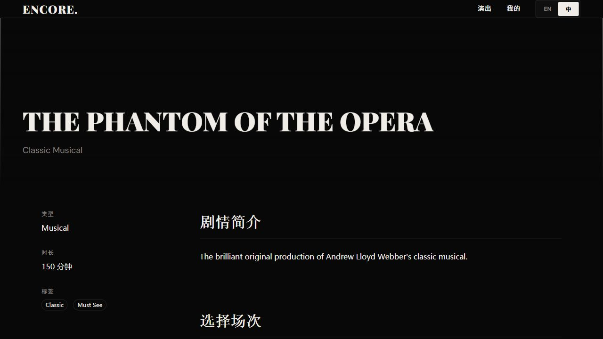
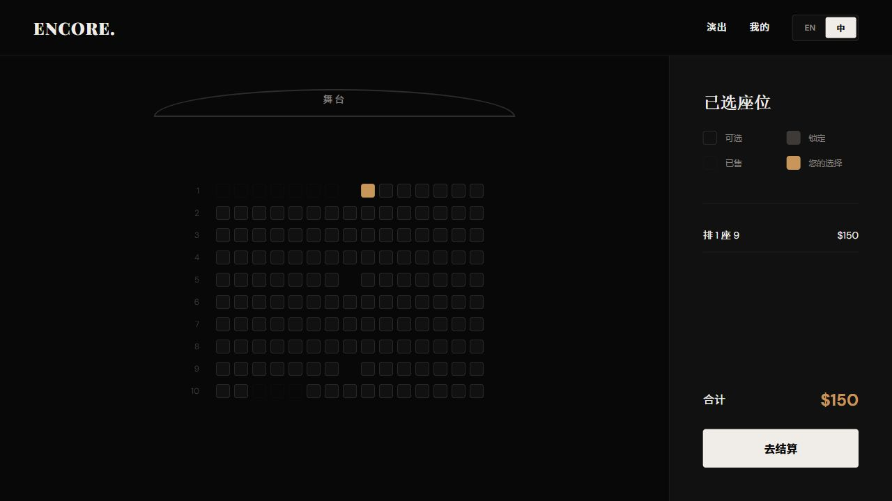
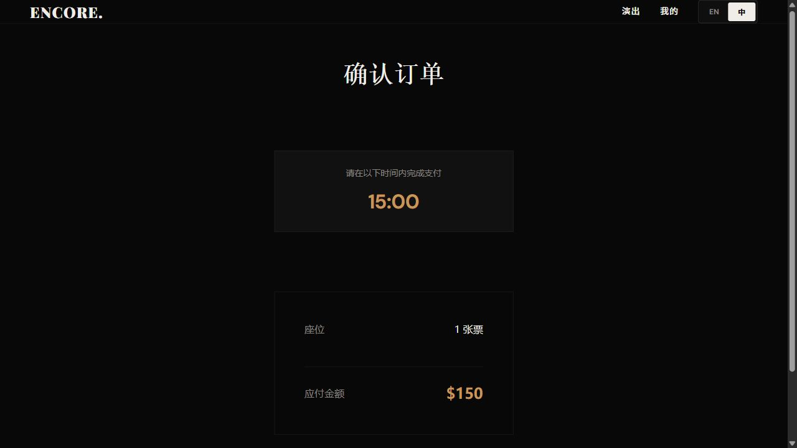
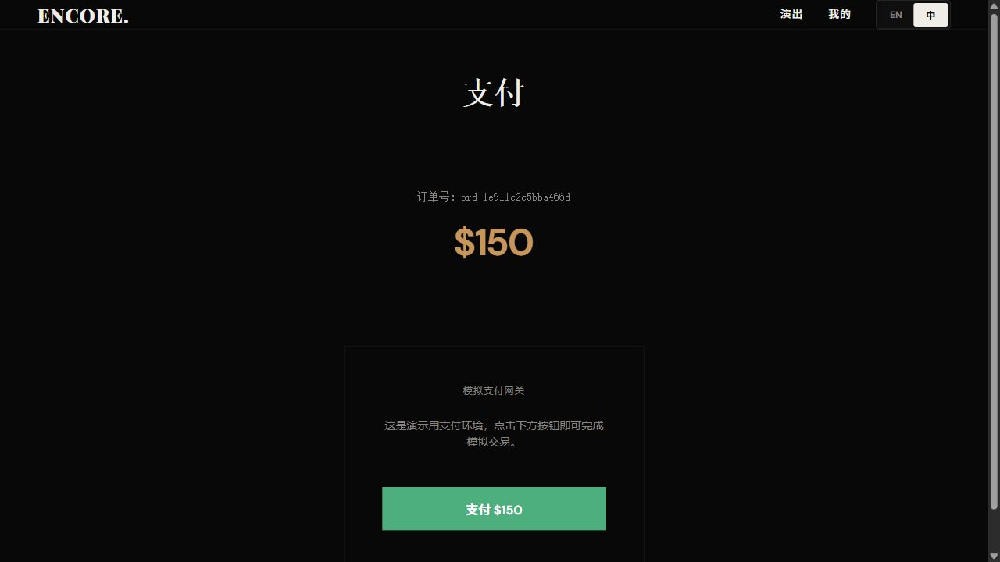
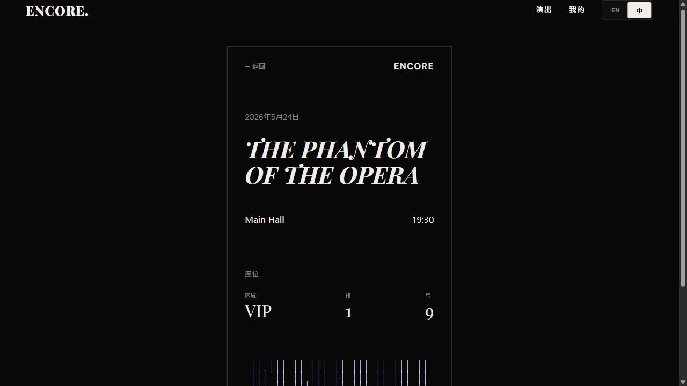

# ENCORE Purchase Flow Evidence - 2026-05-17

## Summary

This evidence set captures the real browser purchase flow against the local full-stack environment.

- Frontend: `http://localhost:5173`
- Backend: `http://localhost:8080`
- Account: `user / 123`
- Flow time: `2026-05-17 00:58` Asia/Shanghai
- Show: `THE PHANTOM OF THE OPERA`
- Schedule: `sch-101`, Main Hall, `2026-05-24 19:30`
- Seat: `seat-1-9`
- Order: `ord-1e911c2c5bba466d`
- Ticket code: `TMP8LC0P51-9XYZ`
- Final order status: `PAID`
- Ticket status: `UNUSED`

## Screenshots

| Step | Evidence | Verification |
| --- | --- | --- |
| 1. Login |  | Login page is reachable and ready for `user/123`. |
| 2. Home |  | Public show list loads backend shows. |
| 3. Show detail |  | `THE PHANTOM OF THE OPERA` detail page shows `ON_SALE` schedules. |
| 4. Seat selection |  | Seat map loads real seat states and selects one available seat. |
| 5. Order confirmation |  | Confirmation page shows countdown, ticket count, and total amount. |
| 6. Payment |  | Mock payment page loads order `ord-1e911c2c5bba466d`. |
| 7. E-ticket |  | Payment completes and electronic ticket shows code `TMP8LC0P51-9XYZ`. |

## Verification Notes

- `GET /api/health` returned `code:0` before browser verification.
- `mvn test` passed with `CheckInServiceTest` 9/9.
- `npm run build` passed; only existing Sass `@import` deprecation and large chunk warnings remain.
- Backend order detail returned `status: PAID`, one ticket for `seat-1-9`, and ticket status `UNUSED`.
